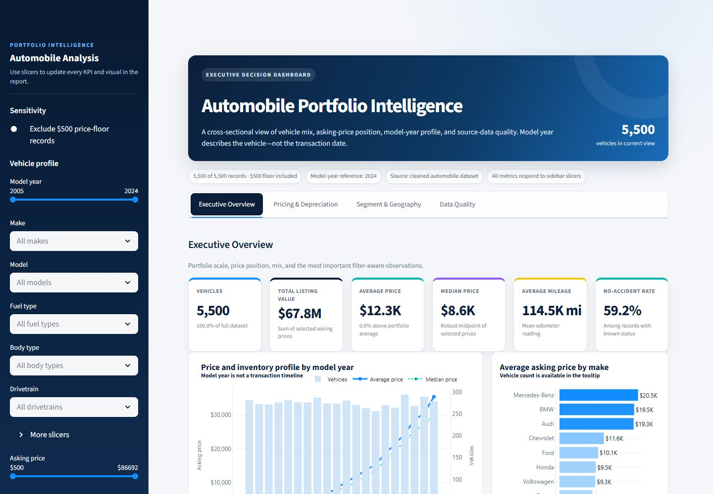

<div align="center">

# Automobile Intelligence Dashboard

### A reproducible Python data-cleaning pipeline and Power BI-inspired analytics experience

[](https://www.python.org/)
[](https://streamlit.io/)
[](https://plotly.com/python/)
[](https://docs.astral.sh/ruff/)

**Created by Hieu Nguyen**
</div>
Click here to access dashboard: https://automobileanalysis-irybegenoqkyndth2o784z.streamlit.app/



## Overview

This project turns a raw automobile listing dataset into an analysis-ready
dataset, a transparent data-quality report, and an interactive executive
dashboard. The interface borrows the clear information hierarchy of Microsoft
Power BI: slicers, KPI cards, business callouts, linked charts, and a dedicated
data-quality view.

The workflow is designed to be reproducible. Every transformation—from column
normalization to group-based imputation and quality flags—is implemented in
Python and documented with numbered steps in the source code.

## Business snapshot

| Measure | Portfolio result |
|---|---:|
| Vehicles | 5,500 |
| Total listed value | $67.76M |
| Average asking price | $12,320 |
| Median asking price | $8,586 |
| Average mileage | 114,529 |
| SUVs as a share of inventory | 49.15% |
| Electrified share | 12.40% |
| Cell-level source completeness | 92.61% |

Selected insights:

- Model years 2020–2024 are **25.35% of inventory** but **57.83% of listed
  value**.
- SUVs contribute **54.31% of listed value** and have an average asking price
  approximately **20.5% above sedans** before mix adjustment.
- Mercedes-Benz, Audi, and BMW represent **28.93% of vehicles** but **46.40% of
  listed value**.
- Model year has the strongest observed relationship with price (`r = +0.805`);
  mileage (`r = -0.683`) and owner count (`r = -0.669`) are strongly negative.
- The apparent EV price premium is heavily influenced by newer model years and
  lower mileage, so the dashboard treats it as a mix effect rather than a
  causal fuel-type premium.

Read the complete interpretation in
[reports/business_insights.md](reports/business_insights.md).

## Microsoft Power BI report

**[Download the ready-to-open Power BI report](Power%20BI/Automobile_Analysis_PowerBI.pbix)**

The repository includes a native Microsoft Power BI Desktop report with an
embedded snapshot of the cleaned dataset. Its **Executive Overview** and
**Business Insights** pages combine KPI cards, 11 reusable DAX measures, model
and fuel-mix visuals, data-quality indicators, and decision-ready commentary.
The model-level combo chart places Average Price and Median Price lines above
Vehicle Count columns, with the columns set to **85% opacity** for clear visual
comparison.

Download the `.pbix` file and open it in Power BI Desktop; no Python setup is
required to view the saved report. See the
[Power BI report guide](Power%20BI/README.md) for opening, Service deployment,
refresh, measure, RLS, and interpretation details.

The report is also published in the **Finance Analytics [Test]** Power BI
Service workspace. Its Import-mode semantic model reads the cleaned dataset
from the public GitHub Web CSV and is scheduled to refresh daily at
**6:00 AM Eastern Time (US and Canada)**. A manual refresh completed
successfully on **July 24, 2026 at 3:49:19 PM ET**, validating the Web source
and Service refresh configuration.

Five RLS roles segment read-only consumers into Northeast, Midwest, South,
West, and unknown-location data-quality views. The roles are published with
their DAX filters but currently have **0 members each**. RLS applies to
**Viewer/read-only consumers**; workspace Admin, Member, and Contributor roles
are not constrained by these filters. See the
[Power BI report guide](Power%20BI/README.md#row-level-security) for the full
role-to-DAX mapping and assignment notes.

## Dashboard experience

The app is organized into four analysis views:

1. **Executive Overview** — portfolio KPI cards, model-year pricing curve,
   make ranking, fuel mix, price-versus-mileage relationship, and dynamic
   insight callouts.
2. **Pricing & Depreciation** — price distribution, cohort comparisons,
   condition analysis, age-band heatmap, and a sensitivity control for the
   `$500` source-system price floor.
3. **Segment & Geography** — make/model composition, body and drivetrain mix,
   state-level inventory, and an operational segment matrix.
4. **Data Quality** — completeness KPIs, source missingness, imputation audit,
   boundary flags, and records requiring review.

All global slicers update the visible measures and charts. The dashboard uses
asking/listed terminology because the dataset does not contain completed sales.

## Data-cleaning workflow

The pipeline deliberately retains information instead of using a blanket
`dropna()`:

1. Load the untouched raw CSV and validate the required schema.
2. Normalize headers to `snake_case` and standardize text values.
3. Coerce numeric fields and validate defensible business ranges.
4. Remove only exact duplicates; ambiguous repeated listings remain.
5. Preserve missing categories as `Unknown`.
6. Impute missing numeric specifications within comparable vehicle groups and
   add a `<field>_was_imputed` audit flag.
7. Set missing Electric engine size to `0.0` while preserving genuine
   zero-engine EV records.
8. Add analysis features: vehicle age, age/price/mileage bands, efficiency unit,
   row completeness, and source-quality flags.
9. Validate the output and export a machine-readable quality report.

Important source issues are flagged, not silently erased:

- 1,216 records sit at the `$500` price floor.
- 273 records have mileage exactly equal to `100`.
- 7.39% of source cells are missing; only 24.16% of rows are fully complete.
- One Electric–Manual combination requires source verification.
- Electric efficiency is interpreted as MPGe; other fuel types use MPG.

## Project structure

```text
Automobile_Analysis/
├── .streamlit/
│   └── config.toml
├── assets/
│   └── dashboard-preview.png
├── data/
│   ├── raw/
│   │   └── automobile_dataset.csv
│   └── processed/
│       └── automobile_cleaned.csv
├── reports/
│   ├── business_insights.md
│   └── data_quality_report.json
├── scripts/
│   └── clean_data.py
├── src/
│   └── automobile_analysis/
│       ├── __init__.py
│       ├── analytics.py
│       └── cleaning.py
├── tests/
│   ├── test_analytics.py
│   ├── test_dashboard_rendering.py
│   └── test_cleaning.py
├── app.py
├── pyproject.toml
├── requirements.txt
└── README.md
```

## Quick start

### 1. Clone and enter the project

```bash
git clone https://github.com/hnguyen76/Automobile_Analysis.git
cd Automobile_Analysis
```

### 2. Create an environment and install dependencies

```bash
python -m venv .venv
```

Activate it on Windows:

```powershell
.\.venv\Scripts\Activate.ps1
```

Or on macOS/Linux:

```bash
source .venv/bin/activate
```

Then install:

```bash
python -m pip install --upgrade pip
python -m pip install -r requirements.txt
```

### 3. Build the cleaned dataset

```bash
python scripts/clean_data.py
```

The command writes:

- `data/processed/automobile_cleaned.csv`
- `reports/data_quality_report.json`

### 4. Launch the dashboard

```bash
streamlit run app.py
```

Open the local URL shown in the terminal, normally
`http://localhost:8501`.

## Quality checks

```bash
python -m pytest
python -m ruff check .
python -m ruff format --check .
```

The tests cover schema normalization, duplicate handling, category treatment,
group-based imputation, EV rules, engineered features, quality flags, dashboard
label preservation, KPI calculations, and sensitivity filtering.

## KPI definitions

| KPI | Definition |
|---|---|
| Total listed value | Sum of asking prices for the filtered inventory |
| Average asking price | Arithmetic mean of asking price |
| Median asking price | 50th percentile of asking price |
| Known no-accident rate | No-accident records divided by records with known accident history |
| Full-service rate | Full-service records divided by records with known service history |
| Cell completeness | Non-null source cells divided by all source cells |
| Fully complete rows | Rows with no missing values in the original 18 fields |

## Interpretation limits

- The dataset is cross-sectional and has no listing or transaction date.
- `year` is model year, not the year of sale.
- Asking price is not realized sale price.
- There is no cost, profit, sale status, VIN, or days-on-market field; revenue,
  margin, turnover, and sales-growth KPIs are therefore out of scope.
- Associations in the dashboard are descriptive and should not be interpreted
  as causal effects.
- The data appears synthetic; operational decisions should be validated against
  authoritative source data.

## Technology

- **Python / pandas / NumPy** — cleaning, validation, feature engineering
- **Streamlit** — application and interactive slicers
- **Plotly** — accessible, responsive business visualizations
- **pytest / Ruff** — automated verification and code quality

---

<div align="center">

Designed and developed by **Hieu Nguyen**

</div>
